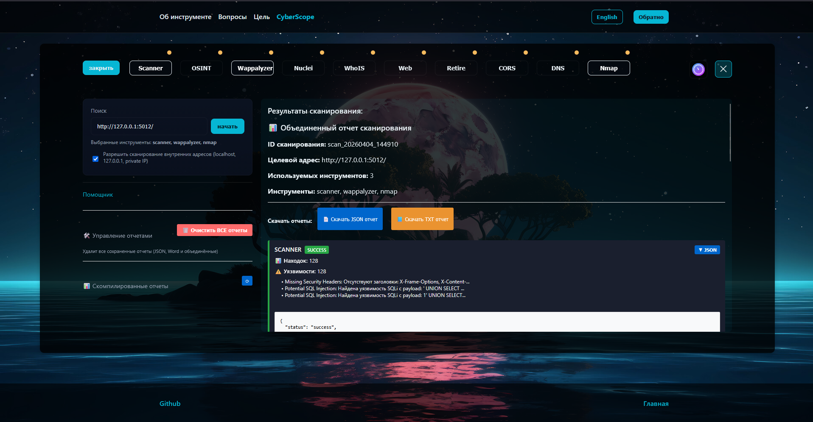

# 🌐 CyberScope

Автоматизированная веб-платформа для комплексного анализа безопасности веб-ресурсов. Объединяет множество инструментов пентеста в едином интерфейсе с поддержкой отчётов JSON, TXT и DOCX.

<video src="cb.gif" controls="controls" style="max-width: 100%;"></video>



## 📖 Описание проекта

**CyberScope** — это комплексное решение для профессиональных пентестеров и специалистов по безопасности, которое позволяет:

- 🎯 **Проводить многоаспектное тестирование безопасности** одного веб-ресурса с использованием 9+ специализированных сканеров
- 🔄 **Автоматизировать рабочий процесс** через единый интерфейс вместо использования отдельных утилит
- 📊 **Генерировать профессиональные отчёты** в формате JSON, TXT и Word (DOCX)
- ⏰ **Планировать периодические проверки** через Telegram-бота для мониторинга в реальном времени
- 💾 **Сохранять полную историю сканирований** для сравнительного анализа

Платформа идеальна для:
- Компаний, проводящих регулярные аудиты безопасности
- Фрилансеров-пентестеров, ускоряющих процесс тестирования
- Команд DevSecOps для интеграции в CI/CD pipeline
- Студентов и исследователей в области кибербезопасности

## 📋 Возможности и сканеры

### 🔍 Модули сканирования

**Сетевое тестирование:**
- **Nmap** — сканирование открытых портов, определение версий сервисов, OS fingerprinting
- **DNS Scanner** — анализ DNS записей, зоны трансферы, конфигурация
- **OSINT** — сбор информации о домене (WHOIS, подdomains, MX записи)

**Безопасность веб-приложений:**
- **Nuclei** — проверка уязвимостей по готовым шаблонам (SQL injection, RCE, LFI и т.д.)
- **CORS Scanner** — анализ конфигурации CORS, выявление неправильных настроек
- **SSL/TLS Scanner** — проверка сертификатов, версий TLS, слабых шифров
- **Web URL Scanner** — обнаружение директорий, файлов и скрытых путей

**Анализ технологий:**
- **Wappalyzer** — определение технологического стека, CMS, фреймворков
- **Retire.js** — поиск устаревших JavaScript библиотек с известными уязвимостями
- **Vulnerability Scanner** — поиск CVE уязвимостей в зависимостях

**Дополнительные инструменты:**
- **JSFinder** — обнаружение JavaScript файлов и API endpoints

### 📊 Отчётность и экспорт

- **Автоматическое объединение результатов** всех сканеров в единый отчёт
- **Экспорт в несколько форматов:**
  - JSON — для автоматизации и интеграции
  - TXT — для быстрого просмотра
  - DOCX — профессиональные отчёты для клиентов
- **Сохранение полной истории** сканирований с timestamps
- **Возможность сравнения результатов** между разными временными периодами
- **Генерация изображений отчётов** для презентаций

### 🤖 Автоматизация через Telegram

- **Планируемые проверки** — настройка периодических сканирований
- **Уведомления в реальном времени** — оповещения о найденных уязвимостях
- **Просмотр результатов** прямо из Telegram-чата
- **Быстрый доступ к отчётам** из мобильного устройства

## 🚀 Быстрый старт

### Требования к системе
- **ОС:** Linux (Ubuntu 20.04+), macOS или Windows (с WSL2)
- **Python:** 3.8+
- **Node.js:** 14+
- **Docker:** 20.10+ (опционально, для контейнеризации)
- **Диск:** минимум 2 ГБ для инструментов

### Установка локально

```bash
# 1. Клонирование репозитория
git clone https://github.com/your-repo/CyberScope.git
cd CyberScope

# 2. Установка зависимостей и инструментов
chmod +x install-tools.sh
./install-tools.sh

# 3. Запуск Backend (FastAPI + Python)
cd backend
python -m venv venv
source venv/bin/activate  # На Windows: venv\Scripts\activate
pip install -r requirements.txt
uvicorn server:app --reload --host 0.0.0.0 --port 8000

# 4. Запуск Frontend (React) - в отдельном терминале
cd frontend
npm install
npm start
# Откроется на http://localhost:3000
```

### Запуск через Docker (рекомендуется)

```bash
# Один-команда запуск всего приложения
docker-compose up

# Backend будет доступен на http://localhost:8000
# Frontend на http://localhost:3000
```

### Использование Telegram-бота

```bash
# Установить токен бота в переменные окружения
export TELEGRAM_BOT_TOKEN="ваш_токен"

# Запустить бота
python backend/bot/bot.py
```

## 🏗️ Архитектура

```
CyberScope/
├── backend/              # Python FastAPI сервер
│   ├── scanners/         # 9+ модулей сканеров
│   ├── core/             # Утилиты для обработки и экспорта отчётов
│   ├── auth/             # Аутентификация и управление пользователями
│   ├── bot/              # Telegram бот для автоматизации
│   ├── reports/          # Папка для сохранения результатов
│   │   ├── json/         # JSON отчёты
│   │   ├── txt/          # TXT отчёты
│   │   ├── word/         # DOCX отчёты
│   │   └── combined/     # Объединённые результаты
│   ├── tools/            # Вспомогательные инструменты
│   ├── utils/            # Утилиты (payload'ы, паттерны и т.д.)
│   ├── server.py         # Основной FastAPI сервер
│   ├── scheduler.py      # Планировщик задач (APScheduler)
│   └── requirements.txt   # Python зависимости
│
├── frontend/             # React приложение
│   ├── public/           # Статические файлы
│   ├── src/
│   │   ├── Component/    # Переиспользуемые UI компоненты
│   │   ├── Pages/        # Страницы приложения
│   │   ├── Modal/        # Модальные окна
│   │   ├── App.jsx       # Корневой компонент
│   │   └── index.js      # Entry point
│   └── package.json      # Node.js зависимости
│
├── docker-compose.yml    # Конфигурация контейнеризации
├── install-tools.sh      # Скрипт установки внешних инструментов
└── README.md            # Документация проекта
```

### Стек технологий

**Backend:**
- FastAPI — асинхронный веб-фреймворк
- SQLAlchemy — ORM для работы с БД
- APScheduler — планировщик фоновых задач
- python-telegram-bot — интеграция с Telegram
- python-docx — генерация Word документов
- pydantic — валидация данных

**Frontend:**
- React 18 — основной фреймворк
- SCSS — препроцессор стилей
- Axios — HTTP клиент
- React Router — маршрутизация

**Инструменты:**
- Nmap — сканирование портов
- Nuclei — проверка уязвимостей
- Wappalyzer — определение технологий
- JSFinder — поиск JavaScript файлов
- Retire.js — проверка устаревших зависимостей

**DevOps:**
- Docker — контейнеризация приложения
- Docker Compose — управление multi-контейнер приложением

## 📸 Примеры использования

### Базовое сканирование через веб-интерфейс

1. Откройте http://localhost:3000
2. Введите URL целевого веб-ресурса
3. Выберите нужные сканеры
4. Нажмите "Начать сканирование"
5. Дождитесь завершения (5-30 минут в зависимости от размера)
6. Экспортируйте результаты в нужном формате

### Запуск сканирования через API

```bash
curl -X POST http://localhost:8000/api/scan \
  -H "Content-Type: application/json" \
  -d '{
    "url": "https://example.com",
    "scanners": ["nmap", "nuclei", "wappalyzer", "ssl"]
  }'
```

## 🔐 Безопасность

- **HTTPS:** Поддержка SSL/TLS для защиты трафика
- **Аутентификация:** JWT токены для защиты API
- **Валидация:** Проверка всех входных данных
- **Логирование:** Детальное логирование всех действий для аудита
- **Изоляция:** Контейнеризация для безопасной изоляции сканеров

## 🐛 Трубулшутинг

### Проблема: "Nmap command not found"
```bash
# Установить Nmap
apt-get install nmap  # Ubuntu/Debian
brew install nmap     # macOS
```

### Проблема: "Permission denied" при запуске Docker
```bash
sudo usermod -aG docker $USER
newgrp docker
```

### Проблема: "Port already in use"
```bash
# Проверить процессы на портах
lsof -i :8000    # Backend
lsof -i :3000    # Frontend

# Остановить конфликтующие процессы
kill -9 <PID>
```


## 📚 Дополнительные ресурсы

- [FastAPI документация](https://fastapi.tiangolo.com/)
- [React документация](https://react.dev/)
- [Nmap документация](https://nmap.org/book/man.html)
- [OWASP Top 10](https://owasp.org/www-project-top-ten/)
- [CWE Top 25](https://cwe.mitre.org/top25/)

## 📊 Статистика проекта

- **Поддерживаемых сканеров:** 9+
- **Форматов экспорта:** 3 (JSON, TXT, DOCX)
- **Строк кода (Backend):** ~5000+
- **Строк кода (Frontend):** ~3000+

## ⚖️ Лицензия и использование

CyberScope распространяется под лицензией **MIT** и предназначен только для:

✅ **Разрешено:**
- Тестирования **собственных** веб-ресурсов
- Легальных пентестов **с письменного согласия** владельца
- Образовательных и исследовательских целей
- Использования в учебных заведениях
- Коммерческого использования при соблюдении условий

❌ **Запрещено:**
- Несанкционированное тестирование чужих систем
- Использование в целях хакерства или кибератак
- Удаление логов о работе инструмента
- Распространение без лицензии

**Используйте ответственно! ⚡**

**Версия:** 1.0.0  
**Последнее обновление:** Апрель 2026  
**Статус:** В активной разработке 🚀
